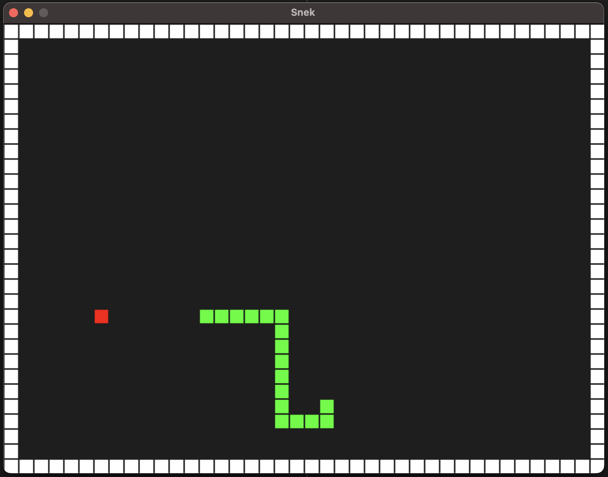

# Snek.rs

Just another minimal implementation of the snake game, this time using in Rust + SDL2.

# Running & local development
1. I tested this with `rustc 1.65.0`, so make sure you have a compatible version.
2. Also make sure your system has the [SDL2 dev libraries](https://github.com/Rust-SDL2/rust-sdl2#sdl20-development-libraries).
3. Clone this repo.
4. `cargo run` it.
5. **Enjoy!**

# The code
- [./src/context.rs](./src/context.rs) - Controls the game state and mechanics.
- [./src/renderer.rs](./src/renderer.rs) - Draws the game state into the sdl canvas.
- [./src/main.rs](./src/main.rs) - Keybindings + game loop and ticks.

