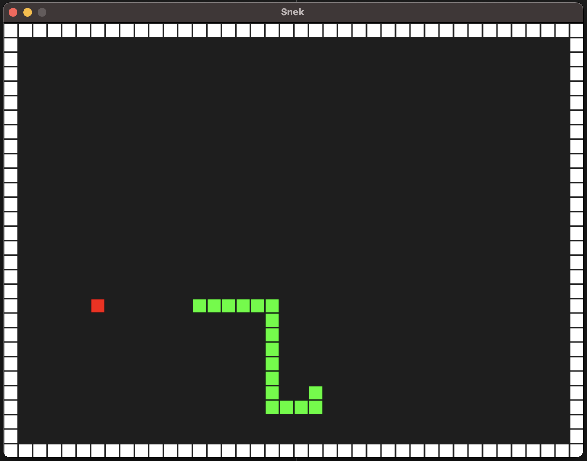

# Snek.rs

A minimal Snake game written in Rust using SDL2.



## Gameplay

- Control a snake with **WASD** keys.
- Eat red food pellets to grow longer.
- Avoid hitting the walls or your own tail.
- Press **Escape** to pause, unpause, or restart after game over.

### Keybindings

| Key       | Action                        |
|-----------|-------------------------------|
| **W**     | Move up                       |
| **A**     | Move left                     |
| **S**     | Move down                     |
| **D**     | Move right                    |
| **Escape**| Pause / Unpause / Restart     |

## Requirements

- **Rust** — tested with `rustc 1.65.0` and newer (edition 2021).
- **SDL2 development libraries** — see the [rust-sdl2 setup guide](https://github.com/Rust-SDL2/rust-sdl2#sdl20-development-libraries) for your platform.

### Platform-specific notes

- **macOS (Apple Silicon):** The `.cargo/config.toml` includes a `rustflag` pointing to Homebrew's library path (`/opt/homebrew/lib`). Install SDL2 with `brew install sdl2`. Remove or adjust this config if you're on a different architecture.
- **Linux:** Install `libsdl2-dev` (or the equivalent for your distribution).
- **Windows:** See the rust-sdl2 [Windows setup](https://github.com/Rust-SDL2/rust-sdl2#windows-msvc) instructions.

## Building & Running

```sh
git clone https://github.com/your-username/snek.rs.git
cd snek.rs
cargo run --release
```

For development (with faster compile times, no optimizations):

```sh
cargo run
```

## Architecture

The project is split into three modules:

| File                        | Responsibility                                   |
|-----------------------------|--------------------------------------------------|
| [`src/main.rs`](./src/main.rs)     | SDL2 initialization, event loop, input handling |
| [`src/context.rs`](./src/context.rs) | Game state: snake position, food spawning, collision detection, direction changes |
| [`src/renderer.rs`](./src/renderer.rs) | SDL2 drawing: background, walls, snake, food |

The game runs at **30 FPS** with game logic ticking every **6 frames** (5 ticks per second). On each tick, the snake advances one cell in its current direction.

## Known Limitations

- No score display or high-score tracking.
- Food spawning may hang if the snake fills the entire board.
- The game uses a fixed tick rate; no speed increase as the snake grows.
- No sound effects.
- No test suite (game logic is testable in isolation).

## License

MIT
